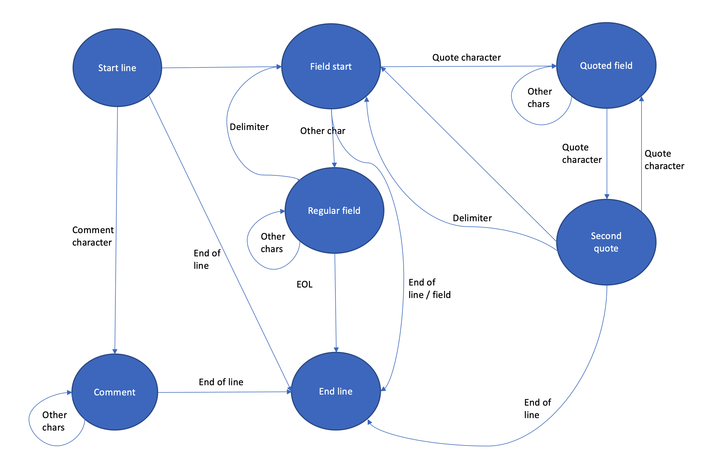

# Custom CSV reader based on finite state machine

## Introduction
The goal of this work is to write a custom CSV reader in Python. A comma-separated values (CSV) file is a delimited text file that uses a comma to separate values. Each line of the file is a data record. Each record consists of one or more fields, separated by commas. [1] 

This reader supports quoted or unquoted fields, escaped characters, comments, CSV files with headers or without and skips empty lines. It will also automatically skip lines that fail to parse and continue to read through the document for any lines that can be parsed successfully to salvage as much data as possible. The result will be held in memory as a list of dictionaries for an easy conversion to Pandas dataframe.

## Usage and examples

1. Install dependencies
    ```python
    # pandas==1.2.3 is the only dep
    pip install -r requirements.txt
    ```

2. Run unit tests to run custom CSV reader on multiple test documents. The grammatically correct documents will be compared to Pandas CSV reader since the result should be the same. For documents containing various errors the custom CSV parser is more forgiving than Pandas CSV reader and will return more inclusive results:

    ```python
     pytest test_csv_reader.py
    ```

3. Run on two example CSV files, convert them to a Pandas dataframes and calculate basic std dev, mean, min and max for the first column (Humidity):
    ```python
     # Example file: weather-data/indoor-temperature-1617.csv
     python csv_example.py
    ```
    Example output:
   ```text
        Attempting to read weather-data/indoor-temperature-1617 modified.csv:
        CSV reader summary: 355 lines read. 355 parsed. 0 failed
        
        Calculate basic statistics for Humidity:
        count    354.000000
        mean      48.519774
        std        5.188886
        min       37.000000
        25%       44.000000
        50%       48.000000
        75%       52.000000
        max       59.000000
        Name: Humidity, dtype: float64
        count    354.000000
        mean      48.440678
        std        7.858027
        min      -20.000000
        25%       44.000000
        50%       48.000000
        75%       52.000000
        max      100.000000
        Name: Humidity, dtype: float64
   ```
  
4. Use a CLI to read any CSV document and convert it to Pandas dataframe:
    ```python
     python csv_cli.py weather-data/indoor-temperature-1617.csv
    ```

## Method
The implementation of this CSV reader is based on the finite state automaton. The inspiration for the implementation was an article [Why to build your own CSV Parser](https://www.codeproject.com/Articles/1175263/Why-to-Build-Your-Own-CSV-Parser-or-Maybe-Not) by [Tomas Takac](https://www.codeproject.com/script/Membership/View.aspx?mid=571194)
 who wrote a very capable CSV parser based on the FSM concept in C#. My implementation follows the same principle of the finite state machine but it's simplified. To avoid running into troubles when running the code on different operating systems the decision was made to leave as much as possible of the file handling to Python system libraries, e.g. line endings that vary between operating systems, EOF / EOL / BOM. The following diagram describes the automaton: 




### Code description

### Important functions
The CSV document is read by calling read_csv method which takes path to CSV file as the only mandatory parameter. It loops through each line of the file and calls the CSV parser. In the end header and records are merged together (for clarity purposes code with less significance has been removed):

```{python}
def read_csv(fname, header = True):
    """ Read a comma-separated CSV document

    :param fname: path to a CSV file
    :param header: interpret first line as header
    :return: CSV represented as list of dictionaries
    """

    ...
    
    with open(fname, 'r+', encoding='utf-8-sig') as csvfile:            
        try:
            if header and count_total==1:
                documentHeader = list(record.values())
            else:
                document.append(record)
        except:
            # log error       
            
        else:
            #no more lines to read
            pass
    
    return merge_header(document, documentHeader)
```

The method for parsing each line has a FSM stepping through every character of the string. To simplify working with EOL/EOF characters this is left to Python system libraries and since the FSM does not detect any line endings this also handled here:

 ```{python}
def parseline(line):
    state = LineState(line)    

    for char in line:
        while True:
            process_next = state.next_step(char)
            if process_next:
                break
    state.collect_field()
    return state.get_record()
```

Each line is represented by LineState class (here also some code omitted for clarity purposes). A LineState stores the content of the current CSV column being red in current_field and the current character pointed to in current_char. The final result is stored as a dictionary in record variable:

 ```{python}
class LineState:
    def __init__(self, line, header = None):                
        self.state = StartLineState()
        self.current_char = line[0]
        self.current_field = ''
        self.record = list()

    ...

    def is_comment(self):
        return self.current_char == DEFAULT_COMMENT

    def is_quote(self):
        return self.current_char == DEFAULT_QUOTATION

    def is_delimiter(self):
        return self.current_char == DEFAULT_DELIMITER

    def next_step(self, char):
        self.current_char = char
        return self.state.next_step(self)
```
Other states of the automaton follow the logic of the aforementioned diagram:
```python
class CommentState:
    def next_step(self, linestate):
        if linestate.is_end_of_line():
            linestate.state = EndLineState()
            return False
        return True

class StartFieldState:
    def next_step(self, linestate):
        if linestate.is_end_of_line():
            linestate.state = EndLineState()
            return False
        elif linestate.is_quote():
            linestate.state = QuotedFieldState()
            return True
        else:
            linestate.state = RegularFieldState()
            return False

class StartLineState:
    def next_step(self, linestate):
        if linestate.is_end_of_line():
            linestate.state = EndLineState()
            return False
        elif linestate.is_comment():
            linestate.state = CommentState()
            return False
        else:
            linestate.state = StartFieldState()
            return False


class QuotedFieldState:
    def next_step(self, linestate):
        if linestate.is_end_of_line():
            linestate.state = EndLineState()
            return False
        elif linestate.is_quote():
            linestate.state = DoubleQuoteState()
            return True
        else:
            linestate.current_field += linestate.current_char
            return True

class RegularFieldState:
    def next_step(self, linestate):
        if linestate.is_end_of_line():
            linestate.state = EndLineState()
            return False
        elif linestate.is_delimiter():
            linestate.state = StartFieldState()
            linestate.collect_field()
            return True
        else:
            linestate.current_field += linestate.current_char
            return True

class DoubleQuoteState:
    def next_step(self, linestate):
        if linestate.is_end_of_line():
            linestate.state = EndLineState()
            return False
        elif linestate.is_delimiter():
            linestate.state = StartFieldState()
            linestate.collect_field()
            return True
        elif linestate.is_quote():
            linestate.current_field += linestate.current_char
            linestate.state = QuotedFieldState()
            return True
        else:
            raise Exception('Unexpected character following the second quote')

```

## Results
The final CSV reader seems resistant to many types of human errors being able to read even document as malformed as the example below. Here example lines 1,2,4,5,6 and 10 can be read successfully. CSV reader cannot recover only from wrong number of columns or unclosed quotes in example line 3,7,8 and 9:

```csv
"DateTime","Humidity","Temperature","Temperature_range (low)","Temperature_range (high)"
# Comment
# Comment
# Two correct lines:
"2016-10-09 00:00:00",54,21.93,21,22.8
"2016-10-10 00:00:00",52,21.77,20.4,23.6

# Missing quote in first column:
"2016-10-12 00:00:00,51,21.44,20,23.6

# additional quote in second column:
"2016-10-14 00:00:00",52",21.02,19.6,22.6

# quoted string in second column:
"2016-10-14 00:00:00", 52"string", 21.02,19.6,22.6

# Empty characters in second column:
"2016-10-14 00:00:00", 52      , 21.02,19.6,22.6

# Additional delimiter at the end:
"2016-10-14 00:00:00", 52"string", 21.02,19.6,22.6,

# Columns missing:
"2016-10-14 00:00:00", 

# Empty columns:
,,,,

# Empty date:
"", 52"string", 21.02,19.6,22.6
```

The reader was not built with speed in mind and performs on average 10x slower than Pandas default reader. It needs approximatelly 100ms to read a CSV file with 354 lines and the Pandas reader needs only approximatelly 2ms for the same file. However Pandas CSV reader is less tolerant of human errors like empty spaces, lines, comments and malformed header even when using an option to ignore errors (error_bad_lines=False). So in cases like this it might be beneficial to use a custom CSV reader to salvage more data from a document even if the performance is worse.

## Potential further improvements
A very useful next improvement would be to allow user to control characters like delimiters, quotation characters and escape characters. Many EU countries use comma as a decimal separator and prefer for example a semicolon as default CSV separator.


[1]: https://en.wikipedia.org/wiki/Comma-separated_values